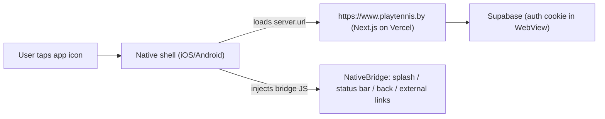

# Mobile apps (iOS + Android) — Capacitor

PlayTennis.by ships to the App Store and Google Play as a **Capacitor hosted-URL
wrapper**. The web app is a Next.js 16 SSR platform (server actions, `proxy.ts`
session refresh, cron, API routes) and cannot be statically exported, so the
native shell loads the deployed production site and layers native capabilities
(splash, status bar, hardware back button, external-link handling) on top.



## Layout

| Path | Purpose |
| --- | --- |
| `capacitor.config.ts` | App id, name, `server.url`, plugin config |
| `mobile/www/index.html` | Offline fallback page (the bundled `webDir`) |
| `resources/` | Source `icon.png` + `splash*.png` for asset generation |
| `scripts/generate-mobile-assets.mjs` | Rebuilds `resources/` from `public/icons/icon.svg` |
| `components/mobile/native-bridge.tsx` | Client glue, active only inside Capacitor |
| `ios/` , `android/` | Generated native projects (committed) |

- **App ID:** `by.playtennis.app`
- **App name:** `PlayTennis.by`
- **Target URL:** `https://www.playtennis.by` (override with `CAP_SERVER_URL`)

## Prerequisites

- Node 20+, Xcode (iOS), Android Studio + SDK (Android), Java 17
- `npm install` (Capacitor deps are in `package.json`)

## Everyday workflow

Because we load a remote URL, **there is no web bundle to rebuild for native**.
The native app reflects whatever is deployed to production, so:

1. Ship web changes to Vercel as usual (the `NativeBridge` glue must be deployed
   for splash-hide / status bar / external links to work in the native app).
2. Only re-sync native when Capacitor config, plugins, or assets change:

```bash
npm run cap:sync          # copy config + plugins into ios/ and android/
npm run cap:assets        # regenerate icons/splashes from resources/
```

### Point the app at a local dev server

```bash
CAP_SERVER_URL="http://192.168.1.10:3000" npm run cap:sync
npm run cap:run:ios       # or cap:run:android
```

(Use your machine's LAN IP, not `localhost`, so the device/emulator can reach it.)

## Build & publish

### iOS (App Store)

```bash
npm run cap:ios           # sync + open Xcode
```

In Xcode: set the Team/signing under *Signing & Capabilities*, bump the build
number, then *Product → Archive → Distribute App → App Store Connect*.

### Android (Google Play)

```bash
npm run cap:android       # sync + open Android Studio
```

In Android Studio: *Build → Generate Signed Bundle / APK → Android App Bundle*,
sign with the upload keystore (keep it out of git — see `.gitignore`), and upload
the `.aab` to the Play Console.

## Regenerating icons / splash

Edit `public/icons/icon.svg`, then:

```bash
node scripts/generate-mobile-assets.mjs   # rebuild resources/
npm run cap:assets                        # fan out to all densities
```

## Known follow-ups

- **Push notifications.** Not wired yet. Add `@capacitor/push-notifications`
  plus APNs/FCM credentials when needed.
- **App Store Guideline 4.2 (minimum functionality).** Pure website wrappers can
  be rejected. We already add native splash, status bar, back-button and external
  link handling; add push notifications and native share before submission if a
  reviewer pushes back.

## OAuth setup (Google + Apple sign-in)

"Continue with Google" and "Continue with Apple" appear on the login screen on
**web, iOS and Android**. The flows differ by platform (gated on
`Capacitor.isNativePlatform()`):

- **Web** — `supabase.auth.signInWithOAuth({ provider, redirectTo:
  <origin>/api/auth/callback })`. The existing PKCE callback route runs
  `exchangeCodeForSession` and the profile-based redirect.
- **Native (iOS/Android)** — `@capgo/capacitor-social-login` returns a provider
  **id-token**, which we exchange with `supabase.auth.signInWithIdToken(...)` on
  the cookie-backed browser client, then hard-navigate to `/api/auth/post-login`.
  Google's OAuth screen is blocked inside WebViews, so the id-token flow is
  mandatory on device.

Implementation: `lib/auth/oauth.ts` (branching + result mapping),
`lib/capacitor/platform.ts` (native detection),
`components/auth/oauth-buttons.tsx` (branded buttons),
`SocialLogin.initialize(...)` reads the `NEXT_PUBLIC_*` client IDs below.

### Account linking

Accounts that share the **same confirmed email** are auto-linked by Supabase
(default behaviour — an email/password user who later signs in with Google/Apple
on that email ends up as one account). No manual link screen; `enable_manual_linking`
stays `false` in `supabase/config.toml`.

### Placeholders you MUST fill before native builds work

These are intentionally left as placeholders in the repo:

| Where | Placeholder | Replace with |
| --- | --- | --- |
| Env (Vercel) | `NEXT_PUBLIC_GOOGLE_WEB_CLIENT_ID` | Google **Web application** OAuth client ID (also the iOS token audience) |
| Env (Vercel) | `NEXT_PUBLIC_GOOGLE_IOS_CLIENT_ID` | Google **iOS** OAuth client ID |
| Env (Vercel) | `NEXT_PUBLIC_APPLE_SERVICES_ID` | Apple **Services ID** (Android Apple sign-in only) |
| Env (Vercel) | `NEXT_PUBLIC_APPLE_REDIRECT_URL` | Server callback for Android Apple, e.g. `https://<ref>.supabase.co/auth/v1/callback` |
| `ios/App/App/Info.plist` | `CFBundleURLTypes` entry (removed — ASC rejects the malformed placeholder) | Add back a `CFBundleURLTypes` → `CFBundleURLSchemes` entry with the **reversed** iOS client ID (`com.googleusercontent.apps.<id>`) |
| Google Cloud Console | Android SHA-1 fingerprints | Debug (`./gradlew signingReport`), release, and Play App Signing SHA-1s registered on an **Android** OAuth client with package `by.playtennis.app` |

### Google Cloud Console

1. Create OAuth clients in **one** project: a **Web application** client, an
   **iOS** client (bundle id `by.playtennis.app`), and an **Android** client per
   signing certificate (debug + release + Play App Signing) with package
   `by.playtennis.app` and its SHA-1. Credential Manager needs the **Web** client
   ID as the token audience — do **not** put the Android client ID in
   `NEXT_PUBLIC_GOOGLE_WEB_CLIENT_ID`.
2. In the **Supabase dashboard → Auth → Providers → Google**: enable it, paste the
   Web client ID + secret, and add the **iOS** client ID to *Authorized Client IDs*
   so `signInWithIdToken` accepts iOS-issued tokens.

### Apple Developer

1. Enable the **Sign in with Apple** capability for App ID `by.playtennis.app`
   (the entitlement is committed at `ios/App/App/App.entitlements`; add the
   capability to the target in Xcode so the provisioning profile carries it).
2. For **Android** Apple sign-in, create a **Services ID**, a Sign in with Apple
   **Key** (Team ID + Key ID + `.p8`), and set the return URL to your Supabase
   auth callback. Put the Services ID in `NEXT_PUBLIC_APPLE_SERVICES_ID` and the
   callback in `NEXT_PUBLIC_APPLE_REDIRECT_URL`.
3. In the **Supabase dashboard → Auth → Providers → Apple**: enable it, add the
   Services ID + generated client secret, and ensure both the app **bundle id**
   and the **Services ID** are accepted audiences for the id-token flow.

### After changing native config

```bash
npm run cap:sync   # copies capacitor.config.ts + installs the plugin into ios/ & android/
```

Native OAuth cannot be validated locally without Apple/Google developer accounts
and signed builds; web OAuth can be tested against a Supabase project with the
providers enabled.
