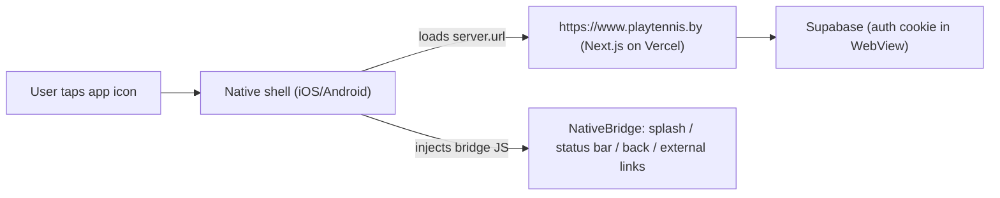

# Mobile apps (iOS + Android) — Capacitor

PlayTennis.by ships to the App Store and Google Play as a **Capacitor hosted-URL
wrapper**. The web app is a Next.js 16 SSR platform (server actions, `proxy.ts`
session refresh, cron, API routes) and cannot be statically exported, so the
native shell loads the deployed production site and layers native capabilities
(splash, status bar, hardware back button, external-link handling) on top.



## Layout

| Path | Purpose |
| --- | --- |
| `capacitor.config.ts` | App id, name, `server.url`, plugin config |
| `mobile/www/index.html` | Offline fallback page (the bundled `webDir`) |
| `resources/` | Source `icon.png` + `splash*.png` for asset generation |
| `scripts/generate-mobile-assets.mjs` | Rebuilds `resources/` from `public/icons/icon.svg` |
| `components/mobile/native-bridge.tsx` | Client glue, active only inside Capacitor |
| `ios/` , `android/` | Generated native projects (committed) |

- **App ID:** `by.playtennis.app`
- **App name:** `PlayTennis.by`
- **Target URL:** `https://www.playtennis.by` (override with `CAP_SERVER_URL`)

## Prerequisites

- Node 20+, Xcode (iOS), Android Studio + SDK (Android), Java 17
- `npm install` (Capacitor deps are in `package.json`)

## Everyday workflow

Because we load a remote URL, **there is no web bundle to rebuild for native**.
The native app reflects whatever is deployed to production, so:

1. Ship web changes to Vercel as usual (the `NativeBridge` glue must be deployed
   for splash-hide / status bar / external links to work in the native app).
2. Only re-sync native when Capacitor config, plugins, or assets change:

```bash
npm run cap:sync          # copy config + plugins into ios/ and android/
npm run cap:assets        # regenerate icons/splashes from resources/
```

### Point the app at a local dev server

```bash
CAP_SERVER_URL="http://192.168.1.10:3000" npm run cap:sync
npm run cap:run:ios       # or cap:run:android
```

(Use your machine's LAN IP, not `localhost`, so the device/emulator can reach it.)

## Build & publish

### iOS (App Store)

```bash
npm run cap:ios           # sync + open Xcode
```

In Xcode: set the Team/signing under *Signing & Capabilities*, bump the build
number, then *Product → Archive → Distribute App → App Store Connect*.

### Android (Google Play)

```bash
npm run cap:android       # sync + open Android Studio
```

In Android Studio: *Build → Generate Signed Bundle / APK → Android App Bundle*,
sign with the upload keystore (keep it out of git — see `.gitignore`), and upload
the `.aab` to the Play Console.

## Regenerating icons / splash

Edit `public/icons/icon.svg`, then:

```bash
node scripts/generate-mobile-assets.mjs   # rebuild resources/
npm run cap:assets                        # fan out to all densities
```

## Known follow-ups

- **Google OAuth in WebView.** Google blocks its OAuth screen inside embedded
  WebViews (`disallowed_useragent`). Email/password and magic-link login work as
  is. To support Google sign-in natively, open the OAuth URL via `@capacitor/browser`
  and return through a custom-scheme deep link (`by.playtennis.app://`), and add
  that redirect URL in Supabase Auth settings.
- **Push notifications.** Not wired yet. Add `@capacitor/push-notifications`
  plus APNs/FCM credentials when needed.
- **App Store Guideline 4.2 (minimum functionality).** Pure website wrappers can
  be rejected. We already add native splash, status bar, back-button and external
  link handling; add push notifications and native share before submission if a
  reviewer pushes back.
