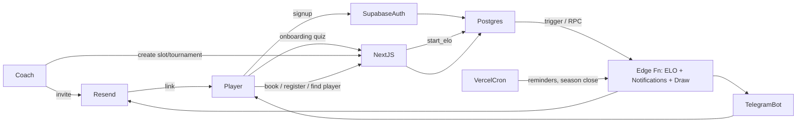

# Техническое задание — Aliaksandr Bury Tennis Platform

> Версия 1.0 · Базовая редакция для AI-агента-разработчика
> Связанные документы: [AGENTS.md](../AGENTS.md), [AI_BUILD_PLAN.md](AI_BUILD_PLAN.md), [data-model.md](diagrams/data-model.md), [user-flows.md](diagrams/user-flows.md), [design-tokens.md](design-tokens.md), [copy-deck.md](copy-deck.md), [admin-help.md](admin-help.md), [rating-algorithm.md](rating-algorithm.md)

## 0. Контекст и цель

**Заказчик** — Александр Бурый: экс-профессионал ATP (пара №59 в 2015 году, чемпион Swiss Open Gstaad 2015 в паре с Денисом Истоминым), рост 203 см, одноручный бэкхенд (как у его кумира — Роджера Федерера). Сейчас тренер. Проект развивается в **Польше**.

**Vision проекта.** Это **не просто приложение для одного клуба**, а платформа для любительского тенниса со следующими ценностями:

- **Единый Elo-рейтинг**, который путешествует с игроком между турнирами/тренерами/товарищескими матчами.
- **Игроку легко найти партнёра** своего уровня в своём районе и в удобное время.
- **Тренеров можно оценивать** и видеть отзывы — чтобы любители не шли к плохим тренерам "потому что просто нашли".
- **Тренеры могут проводить турниры** в гибких форматах с автоматической сеткой, счётом и пересчётом рейтинга.

**Конкурентная среда.** В Польше доминирует **Klubu.org** для бронирования кортов — мы НЕ конкурируем по бронированию площадок. Наш фокус: **сообщество, рейтинг, матчи**. Бронирование собственных слотов тренера — частный случай для клиентов конкретного тренера, не основной продукт.

## 1. Роли и доступ

| Роль | Доступ |
|---|---|
| `admin` | Команда платформы. Глобальные настройки, алгоритм рейтинга, onboarding-квиз, модерация, сезонная гонка, шаблоны уведомлений. |
| `coach` | Любой подтверждённый тренер. Создаёт турниры, слоты, локации, заносит результаты; имеет публичный профиль с отзывами. |
| `player` | Обычный пользователь. Участвует в турнирах, ищет партнёров, бронирует слоты, оставляет отзывы. |
| `guest` | Публичные страницы (лидерборд, сетки, профили тренеров). |

Один пользователь может быть одновременно `coach` и `player` (boolean-флаги в `profiles`).

## 2. Информационная архитектура

### 2.1. Кабинет игрока (4 таба)

#### Tab 1 — Рейтинг (`/me/rating`)
- Текущий Elo (большим шрифтом, с подписью "уровень: продвинутый/средний/начинающий" — порог из настроек).
- График истории Elo (Recharts, последние 20 матчей).
- Сезонная гонка: текущая позиция в Race, очки, период, призовые места.
- Топ-20 тренеров с фильтром по городу/району; ссылка на полный лидерборд тренеров.

#### Tab 2 — Турниры (`/me/tournaments`)
- Мои турниры (текущие / прошедшие, табы или фильтр).
- Открытые регистрации (фильтры: город, район, формат, уровень, дата).
- Мои ближайшие матчи + быстрый ввод счёта (если разрешено правилами турнира).

#### Tab 3 — Найти игрока (`/me/find`)
- Фильтры: район(ы), Elo ±N (ползунок, default 100), время суток (multi-select из enum availability).
- Список совместимых игроков: фото, имя, район, Elo, общие слоты времени, кнопка "Предложить матч".
- При предложении создаётся `match` со статусом `proposed`; собеседник получает Email-уведомление, а в карточке предложения сразу есть кнопка «Написать в WhatsApp» (`wa.me`-ссылка) для прямой коммуникации.
- После согласия матч переходит в `scheduled`; игроки могут привязать его к слоту/корту (Phase 2) или просто договориться.
- После игры — ввод счёта обоими (или одним с подтверждением второго) → `confirmed` → пересчёт Elo.

#### Tab 4 — Профиль (`/me/profile`)
Поля (хранятся в `profiles`, см. [data-model.md](diagrams/data-model.md)):
- **Личное**: имя, фамилия, фото (Supabase Storage), дата рождения, пол.
- **Контакты**: email (read-only из auth), **WhatsApp** (главный мессенджер в Польше — отображается с зелёным акцентом «Главный контакт» и порождает `wa.me`-ссылки в UI), резервный телефон, опциональный Telegram username.
- **Соцсети** (`social_links` JSONB): instagram, facebook, vk, x, tiktok, youtube, website.
- **Локация**: страна (default Poland), город, район (`district_id` из справочника), опц. lat/lng.
- **Спорт-преференции**: рука (R/L), бэкхенд (one_handed/two_handed), любимое покрытие (hard/clay/grass/carpet), любимый игрок, девиз.
- **Удобное время** (`availability` JSONB): `{weekday_morning, weekday_day, weekday_evening, weekend_morning, weekend_day, weekend_evening}` — boolean каждое.
- **Приватность**: показывать ли в "Найти игрока", в публичном лидерборде.
- **Уведомления**: каналы — `notification_email` (главный для автоматических уведомлений), `notification_whatsapp` (для будущей интеграции WhatsApp Business API в Phase 2; в MVP WhatsApp работает только как direct-контакт через `wa.me`), `notification_telegram` (опциональный вторичный канал).
- **Здоровье/приватные** (видит только тренер при бронировании): травмы, аллергии, экстренный контакт.
- **Согласия**: GDPR/152-ФЗ, дата согласия, IP.

### 2.2. Кабинет тренера (`/coach/...`)
Появляется в навигации, если `is_coach = true`.

Страницы:
- `/coach/dashboard` — KPI: ближайшие тренировки, новые брони, активные турниры, средняя оценка отзывов, новые игроки за период.
- `/coach/players` — список клиентов клуба, фильтры, импорт CSV, приглашения.
- `/coach/venues` — CRUD локаций и кортов.
- `/coach/schedule` — календарь, слоты, шаблоны (recurring), исключения.
- `/coach/tournaments` — список + мастер создания (5 шагов).
- `/coach/finance` — таблица броней с paid/unpaid/comped, экспорт CSV.
- `/coach/reviews` — отзывы обо мне, ответы, жалобы.
- `/coach/settings` — клуб (имя, slug, лого, описание, политика отмен), настройки уведомлений.

### 2.3. Админ-панель платформы (`/admin/...`)
Только для роли `admin`.

- `/admin/onboarding-quiz` — редактор вопросов и весов.
- `/admin/algorithm` — конфигуратор алгоритма стартового Elo и K-факторов.
- `/admin/seasons` — сезонная гонка: период, scoring, топ-N, призы.
- `/admin/templates` — шаблоны Email-уведомлений на 3 языках (плюс опциональные Telegram-шаблоны, если бот включён).
- `/admin/moderation` — жалобы на отзывы, спорные результаты матчей, удаление пользователей.
- `/admin/users` — глобальный поиск, выдача ролей, баны.

### 2.4. Публичные страницы
- `/` — лендинг.
- `/leaderboard` — топ игроков (с фильтрами по городу/району/возрасту).
- `/coaches` — список и карта тренеров (Phase 2 для карты).
- `/coaches/[slug]` — публичный профиль тренера + отзывы + ближайшие открытые слоты.
- `/tournaments/[id]` — публичная сетка и регистрация.
- `/help` — глоссарий, FAQ.

## 3. Сквозной паттерн "In-app guidance"

На каждой странице админки и кабинета тренера обязательно:

1. **`<HelpPanel>`** (collapsible, состояние сворачивания в `localStorage`), три блока:
   - **Зачем эта страница** — 1 абзац.
   - **Что ты можешь здесь сделать** — 3–5 пунктов.
   - **Что произойдёт после** — 2–4 пункта (для тренера и для игрока).
2. **`<HelpTooltip>`** на терминах: K-фактор, snake-seeding, super-tiebreak, RRULE, walkover, DSQ, comped, no-ad, pro-set, race и т.д. Тексты — в `messages/{locale}/help.json` под ключом `glossary.<term>`.
3. **`<FlowDiagram>`** в мастерах (создание турнира, recurring slots, рассылка приглашений, onboarding-квиз). Показывает шаги с подсветкой текущего.
4. **Action confirmations** с описанием последствий.
5. **Empty states** не пустые — "Зачем нужно" + CTA.
6. **First-run onboarding tour** для нового тренера (6 шагов с подсветкой) — Итерация 14.
7. **`/help`** — глоссарий и FAQ для всех ролей.

Контент подсказок — в `messages/{locale}/help.json` (PL/EN/RU). Готовые тексты для всех страниц админки — в [admin-help.md](admin-help.md).

## 4. Onboarding-квиз и алгоритм стартового Elo

Подробная спецификация — в [rating-algorithm.md](rating-algorithm.md). Кратко:

- При первой регистрации игрок проходит **квиз 7–12 вопросов**: опыт, частота игры, лучший соперник, самооценка ударов, участие в турнирах.
- На основе ответов считается **стартовый Elo** (по умолчанию диапазон 800–2200, центр 1000).
- Первые **N матчей** (по умолчанию N=10) идут с **повышенным K-фактором** (K=60 вместо K=20) для быстрого "поиска" реального уровня.
- Вопросы и веса редактируются админом через `/admin/onboarding-quiz`. Каждое сохранение создаёт новую `quiz_version`.
- Алгоритм расчёта стартового Elo и K-факторы редактируются через `/admin/algorithm` как декларативный JSON-конфиг (`rating_algorithm_config`).

## 5. Турниры и матчи

### 5.1. Форматы турниров
1. Single Elimination (опц. матч за 3-е место).
2. Double Elimination.
3. Round Robin.
4. Group Stage + Playoff.
5. Swiss System.
6. Compass Draw.

### 5.2. Параметры формата матча (`match_rules` JSONB)

**Структура матча** (`structure`):
- `best_of_3_sets`, `best_of_5_sets`
- `single_set` (до 6, тай-брейк на 6:6)
- `pro_set_8` (до 8, тай-брейк на 8:8)
- `pro_set_10`
- `super_tiebreak_only` (до 10 очков)
- `timed_match` (поле `duration_minutes`: 45/60/90; побеждает ведущий по геймам)
- `first_to_x_games` (поле `target_games`: 4/6/8)

**Правила сета**:
- `set_length`: 6 или 4
- `tiebreak_at_six_six`: bool
- `tiebreak_to`: 7 или 10
- `super_tiebreak_replaces_third_set`: bool

**Преимущество**: `advantage` или `no_ad`.

### 5.3. Жеребьёвка
- По рейтингу (snake-seeding по Elo).
- Случайная (blind draw, анимация).
- Ручная (drag-and-drop).
- Гибрид (топ-N сеяных + остальные random).

### 5.4. Лиги (упрощённый сценарий регистрации)
RR-лига на N человек: после старта система выдаёт сетку матчей "ты vs Иван до 12 апреля"; игроки сами договариваются о месте/времени; заносят счёт; Elo пересчитывается. Привязка к слоту/корту — Phase 2.

### 5.5. Ввод счёта
- Сеты как массив JSONB `[{p1_games, p2_games, tiebreak_p1?, tiebreak_p2?}, ...]`.
- Валидация на сервере: правила структуры, длина сета, тай-брейк.
- Walkover / retire / disqualified — отдельные поля `outcome`.
- Для матчей "вне турнира" (friendlies) — ввод обоими игроками с подтверждением. Один вводит → второй получает уведомление и подтверждает или оспаривает.

## 6. Модули

### 6.1. Аутентификация
- Supabase Auth: email magic-link + Google OAuth (+ Apple опционально, Phase 2).
- При первом входе — autotrigger создаёт `profiles`-запись + ставит `locale` из `Accept-Language`.
- После создания профиля — редирект на `/onboarding/quiz` (если не пройден).

### 6.2. Приглашения
- Тренер из `/coach/players` создаёт приглашение (email + опц. имя + опц. телефон).
- Генерится одноразовый токен (хешируется в БД), отправляется через Resend на email.
- Игрок переходит на `/invite/[token]` → если не залогинен, magic-link или Google → автопривязка к клубу тренера + редирект на квиз.
- Bulk: CSV (email,first_name,last_name) с предпросмотром и пачечной отправкой.
- Срок жизни токена 14 дней, повторная отправка, отзыв.

### 6.3. Локации и корты
- `venues`: name, address, lat/lng, indoor/outdoor, удобства, фото.
- `courts`: number, surface (если отличается), status (active/maintenance).

### 6.4. Слоты и бронирование
- `slot_templates`: court, RRULE-строка, длительность (30/45/60/90/120), тип (individual/pair/group), max_participants, цена-метка, exception_dates JSONB.
- `slots`: материализованные единичные слоты (генерация из template + ручные).
- Drag-to-create в недельном календаре.
- Фильтры для игрока: локация, покрытие, тип, время суток.
- Бронь: один клик → `pending` → автоподтверждение или ручное (флаг в settings).
- Конфликты: `EXCLUDE USING gist (court_id WITH =, tstzrange(starts_at, ends_at) WITH &&)`.
- Лист ожидания (Phase 2).
- Paid-флаг: paid/unpaid/comped.
- Политика отмен (например, не позже 12 ч; настраивается).

### 6.5. Рейтинг (Elo)
Подробно — в [rating-algorithm.md](rating-algorithm.md). Ключевое:
- Формула: `R' = R + K * (S - E)`, `E = 1/(1 + 10^((R_opp - R)/400))`.
- K: 60 (первые 10 матчей) → 32 (10–30) → 20 (далее). Настраивается.
- Множители: friendly ×0.5, открытый турнир ×1.0, финал ×1.25.
- Пересчёт: Postgres-функция `recalc_match_elo(match_id)` в транзакции после `confirm_match_result`.
- Парный матч: пересчёт по средней пары; запись в `rating_history` каждому.

### 6.6. Найти игрока
- Запрос: `district_id IN (...) AND current_elo BETWEEN (mine - radius) AND (mine + radius) AND availability JSONB matches mine`.
- Индекс: `(district_id, current_elo)` + GIN на `availability`.
- Целевая производительность: <100мс на 50К пользователей.
- Кнопка "Предложить матч" → `matches.status = 'proposed'` → нотификация.
- История предложений видна в Tab 3.

### 6.7. Отзывы тренеров
- Кто может оставить: игрок, у которого есть подтверждённая `booking` или `match` с этим тренером (последние 90 дней).
- Поля: `stars` 1–5, `categories` JSONB (technique, motivation, individual_approach, price_quality), `text` (≤2000 символов).
- Ограничения: `UNIQUE (reviewer_id, target_coach_id, source_type, source_id)` — не больше одного отзыва на источник.
- Жалобы: тренер или другой игрок может пожаловаться → попадает в `/admin/moderation`.
- Тренер может ответить на отзыв (`coach_reply` поле).

### 6.8. Сезонная гонка (Race)
- Конфиг (admin): период (start/end), scoring (победа +N, турнир +M, финал +K, бонусы), топ-N для призов, описание призов.
- Race-лидерборд в Tab 1 у игрока.
- В конце сезона cron-задача фиксирует winners в `seasons.winners` JSONB; admin отмечает выдачу призов.

### 6.9. Уведомления и контакт-каналы

> **Приоритет каналов (под Польшу):**
> 1. **WhatsApp** — главный мессенджер для прямого общения. В UI всюду, где есть карточка игрока/тренера, рендерится кнопка «Написать» с `wa.me`-ссылкой (хелпер `lib/contact/whatsapp.ts`). API не нужен.
> 2. **Email (Resend)** — основной канал для автоматических уведомлений (приглашения, подтверждения броней, результаты турниров).
> 3. **Telegram (grammY)** — опциональный вторичный канал. Включается только при `notification_telegram = true` и привязке через `/start <token>` в боте.
> 4. **WhatsApp Business API** (Twilio / Meta Cloud) — Phase 2. После одобрения станет основным каналом для автоматических уведомлений.

- Очередь сообщений: `notifications_outbox.channel ∈ ('email', 'whatsapp', 'telegram')`. Канал `whatsapp` зарезервирован под Phase 2.
- События с шаблонами на PL/EN/RU:
  - приглашение в клуб + напоминания (3, 7 дней)
  - подтверждение брони, отмена, напоминание за 24 ч и 2 ч
  - отмена слота тренером
  - регистрация на турнир: открыта/закрыта/жеребьёвка проведена
  - твой следующий матч через X (час/день)
  - результат матча подтверждён + ΔElo
  - предложение матча в "Найти игрока" (получено / принято / отклонено)
  - новый отзыв о тренере
  - конец сезона + результаты гонки
- Очередь: `notifications_outbox` + Vercel cron (раз в минуту) или Supabase pgmq.

### 6.10. i18n
- next-intl, языки: `pl` (default), `en`, `ru`.
- JSON-файлы: `messages/{locale}/{app, help, emails, telegram}.json` (`telegram.json` опциональный — заполняется только если активен Telegram-бот).
- Локализация дат/чисел: `Intl`.
- Email-шаблоны на 3 языках обязательны; Telegram-шаблоны — опционально, выбор по `profiles.locale`.
- Smart language detection (Accept-Language) + переключатель в шапке.

## 7. Архитектура

```
AlexB-Tennis-Club/
  app/[locale]/
    (public)/              landing, /leaderboard, /coaches, /tournaments/[id], /help
    (player)/              /me/rating, /me/tournaments, /me/find, /me/profile
    (coach)/               /coach/...
    (admin)/               /admin/...
    /onboarding/quiz
    /invite/[token]
  app/api/{telegram,cron,resend-webhook}/route.ts
  components/{ui,domain,help}/
  lib/{supabase,rating,tournament,matching,dates,validators,utils.ts}
  messages/{pl,en,ru}/{app,help,emails,telegram}.json
  supabase/{migrations,functions,seed.sql,config.toml}
  e2e/
  docs/
```

Поток данных:



## 8. Модель данных

См. [data-model.md](diagrams/data-model.md). Кратко — 20 таблиц после оптимизации:

`profiles`, `districts`, `clubs`, `venues`, `courts`, `slot_templates`, `slots`, `bookings`, `tournaments`, `tournament_participants`, `matches`, `rating_history`, `coach_reviews`, `quiz_versions`, `quiz_questions`, `quiz_answers`, `rating_algorithm_config`, `seasons`, `invitations`, `notifications_outbox`, `telegram_links`, `audit_log`.

Ключевые решения по оптимизации:
- `profiles` объединяет старые `profiles` + `players`, флаги ролей boolean'ами.
- `slot_templates` объединяет recurrence_rules + exceptions (RRULE + JSONB exception_dates).
- `matches.sets` — JSONB-массив, нет отдельной `match_sets`.
- `social_links` JSONB вместо 7 колонок.
- `availability` JSONB вместо отдельной таблицы.

## 9. Нефункциональные требования

- TTFB <200мс (public), LCP <2.5с.
- WCAG 2.1 AA.
- Rate-limit публичных API.
- Бэкапы: Supabase PITR.
- GDPR/152-ФЗ: согласие, экспорт, удаление.
- Антифрод отзывов: уникальность + триггер связи + модерация.
- Производительность матчинга: <100мс на 50К пользователей.

## 10. Дизайн

См. [design-tokens.md](design-tokens.md).

- Палитра: Wimbledon green `#1F8A4C`, ball-yellow `#D7F205`, clay `#C75B3A`, ink `#0F1B14`, soft-grass-bg `#EAF7EE`.
- Заголовки: Bricolage Grotesque. Текст: Inter. Числа: JetBrains Mono `tabular-nums`.
- Иллюстрации: SVG-мячи, ракетки, силуэт одноручного бэкхенда.
- Анимации: Framer Motion (bounce, ace, let-cord shake).
- Юмор-копия: см. [copy-deck.md](copy-deck.md).

## 11. Этапы

- **MVP** — Итерации 1–10 (см. [AI_BUILD_PLAN.md](AI_BUILD_PLAN.md)).
- **Phase 2** — Итерации 11–14: остальные форматы турниров, карта тренеров, сезонная гонка с призами, dark mode, e2e, production hardening.
- **Phase 3**: A/B на квизах, видеоразбор, парная статистика, виджеты, попытки интеграции с Klubu.org.

## 12. Открытые допущения

- Платежи — manual (paid/unpaid/comped) в MVP.
- Уведомления — Email + Telegram.
- Языки — PL (default) / EN / RU.
- TZ — `Europe/Warsaw`.
- Валюта — PLN (с возможностью EUR/USD).
- Карта тренеров — MapLibre+OSM, Phase 2.
- Все help-тексты обязательны на всех страницах админки.
