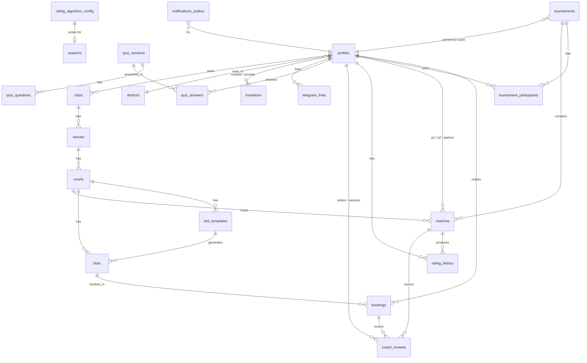

# Data model — Aliaksandr Bury Tennis Platform

20+ tables. All with RLS. UUID PKs (`gen_random_uuid()`). `created_at`/`updated_at` everywhere. JSONB for varying-shape data (socials, availability, match rules, algorithm config).

## ER overview



## DDL (SQL — applied as `supabase/migrations/0001_init.sql`)

```sql
-- ============================================================
-- Aliaksandr Bury Tennis Platform — initial schema
-- ============================================================

create extension if not exists "pgcrypto";
create extension if not exists "btree_gist";

-- ----------------------------------------------------------------
-- 0. Helpers
-- ----------------------------------------------------------------
create or replace function set_updated_at() returns trigger language plpgsql as $$
begin new.updated_at = now(); return new; end $$;

-- ----------------------------------------------------------------
-- 1. Districts (reference)
-- ----------------------------------------------------------------
create table districts (
  id            uuid primary key default gen_random_uuid(),
  country       text not null default 'PL',
  city          text not null,
  name          text not null,
  slug          text not null unique,
  lat           double precision,
  lng           double precision,
  created_at    timestamptz not null default now(),
  updated_at    timestamptz not null default now()
);
create index on districts (country, city);
create trigger trg_districts_updated before update on districts for each row execute function set_updated_at();

-- ----------------------------------------------------------------
-- 2. Profiles  (1:1 with auth.users)
--    Combines old "profiles" + "players" + coach-specific fields
-- ----------------------------------------------------------------
create table profiles (
  id                       uuid primary key references auth.users(id) on delete cascade,
  -- roles (boolean flags, can have multiple)
  is_admin                 boolean not null default false,
  is_coach                 boolean not null default false,
  is_player                boolean not null default true,
  -- personal
  first_name               text,
  last_name                text,
  display_name             text generated always as (coalesce(nullif(trim(first_name||' '||last_name),''), email_local)) stored,
  email_local              text,                       -- cached from auth.users.email for display in generated col
  avatar_url               text,
  date_of_birth            date,
  gender                   text check (gender in ('m','f','other')),
  -- contacts (private — only owner & admin)
  phone                    text,
  whatsapp                 text,
  telegram_username        text,
  -- social_links: {instagram?, facebook?, vk?, x?, tiktok?, youtube?, website?}
  social_links             jsonb not null default '{}'::jsonb,
  -- location
  country                  text not null default 'PL',
  city                     text,
  district_id              uuid references districts(id) on delete set null,
  lat                      double precision,
  lng                      double precision,
  -- sport prefs
  dominant_hand            text check (dominant_hand in ('R','L')),
  backhand_style           text check (backhand_style in ('one_handed','two_handed')),
  favorite_surface         text check (favorite_surface in ('hard','clay','grass','carpet')),
  favorite_player          text,
  motto                    text,
  -- availability: {weekday_morning, weekday_day, weekday_evening, weekend_morning, weekend_day, weekend_evening}
  availability             jsonb not null default '{}'::jsonb,
  -- rating
  current_elo              integer not null default 1000,
  elo_status               text not null default 'provisional' check (elo_status in ('provisional','established')),
  rated_matches_count      integer not null default 0,
  -- coach-specific (nullable)
  coach_bio                text,
  coach_hourly_rate_pln    integer,
  coach_certifications     jsonb,                      -- ["PZT level 1", ...]
  coach_avg_rating         numeric(3,2),               -- denormalized; refreshed by trigger
  coach_reviews_count      integer not null default 0,
  coach_slug               text unique,
  -- privacy & locale
  visible_in_find_player   boolean not null default true,
  visible_in_leaderboard   boolean not null default true,
  notification_email       boolean not null default true,
  notification_telegram    boolean not null default false,
  locale                   text not null default 'pl' check (locale in ('pl','en','ru')),
  timezone                 text not null default 'Europe/Warsaw',
  -- private notes (only coach with linked booking can read)
  health_notes             text,
  emergency_contact        text,
  -- consent
  consent_terms_at         timestamptz,
  consent_privacy_at       timestamptz,
  -- meta
  created_at               timestamptz not null default now(),
  updated_at               timestamptz not null default now()
);
create index on profiles (district_id, current_elo);
create index on profiles using gin (availability);
create index on profiles using gin (social_links);
create trigger trg_profiles_updated before update on profiles for each row execute function set_updated_at();

-- Auto-create profile on auth.users insert
create or replace function handle_new_user() returns trigger language plpgsql security definer set search_path = public as $$
begin
  insert into profiles (id, email_local, locale)
  values (new.id, split_part(new.email, '@', 1), coalesce((new.raw_user_meta_data->>'locale')::text, 'pl'))
  on conflict (id) do nothing;
  return new;
end $$;
create trigger on_auth_user_created after insert on auth.users for each row execute function handle_new_user();

-- ----------------------------------------------------------------
-- 3. Clubs (a coach can have a club brand)
-- ----------------------------------------------------------------
create table clubs (
  id           uuid primary key default gen_random_uuid(),
  owner_id     uuid not null references profiles(id) on delete cascade,
  slug         text not null unique,
  name         text not null,
  description  text,
  logo_url     text,
  created_at   timestamptz not null default now(),
  updated_at   timestamptz not null default now()
);
create trigger trg_clubs_updated before update on clubs for each row execute function set_updated_at();

-- ----------------------------------------------------------------
-- 4. Venues + Courts
-- ----------------------------------------------------------------
create table venues (
  id           uuid primary key default gen_random_uuid(),
  owner_id     uuid not null references profiles(id) on delete cascade,
  club_id      uuid references clubs(id) on delete set null,
  name         text not null,
  address      text,
  city         text,
  district_id  uuid references districts(id) on delete set null,
  lat          double precision,
  lng          double precision,
  is_indoor    boolean not null default false,
  amenities    jsonb not null default '[]'::jsonb,    -- ["showers","parking","cafe"]
  photos       jsonb not null default '[]'::jsonb,    -- urls
  created_at   timestamptz not null default now(),
  updated_at   timestamptz not null default now()
);
create trigger trg_venues_updated before update on venues for each row execute function set_updated_at();

create table courts (
  id           uuid primary key default gen_random_uuid(),
  venue_id     uuid not null references venues(id) on delete cascade,
  number       integer not null,
  name         text,
  surface      text check (surface in ('hard','clay','grass','carpet')),
  status       text not null default 'active' check (status in ('active','maintenance')),
  created_at   timestamptz not null default now(),
  updated_at   timestamptz not null default now(),
  unique (venue_id, number)
);
create trigger trg_courts_updated before update on courts for each row execute function set_updated_at();

-- ----------------------------------------------------------------
-- 5. Slot templates (recurring rules)
-- ----------------------------------------------------------------
create table slot_templates (
  id                  uuid primary key default gen_random_uuid(),
  court_id            uuid not null references courts(id) on delete cascade,
  owner_id            uuid not null references profiles(id) on delete cascade,
  rrule               text not null,                                 -- iCal RRULE string
  start_time          time not null,                                 -- 18:00
  duration_minutes    integer not null check (duration_minutes between 15 and 480),
  slot_type           text not null default 'individual' check (slot_type in ('individual','pair','group')),
  max_participants    integer not null default 1,
  price_pln           integer,
  notes               text,
  exception_dates     jsonb not null default '[]'::jsonb,            -- ["2026-04-25", ...]
  active              boolean not null default true,
  created_at          timestamptz not null default now(),
  updated_at          timestamptz not null default now()
);
create trigger trg_slot_templates_updated before update on slot_templates for each row execute function set_updated_at();

-- ----------------------------------------------------------------
-- 6. Slots (materialized single occurrences)
-- ----------------------------------------------------------------
create table slots (
  id                  uuid primary key default gen_random_uuid(),
  court_id            uuid not null references courts(id) on delete cascade,
  template_id         uuid references slot_templates(id) on delete set null,
  owner_id            uuid not null references profiles(id) on delete cascade,
  starts_at           timestamptz not null,
  ends_at             timestamptz not null,
  slot_type           text not null default 'individual' check (slot_type in ('individual','pair','group')),
  max_participants    integer not null default 1,
  price_pln           integer,
  notes               text,
  status              text not null default 'open' check (status in ('open','closed','cancelled')),
  created_at          timestamptz not null default now(),
  updated_at          timestamptz not null default now(),
  check (ends_at > starts_at),
  exclude using gist (
    court_id with =,
    tstzrange(starts_at, ends_at, '[)') with &&
  ) where (status <> 'cancelled')
);
create index on slots (starts_at);
create index on slots (court_id, starts_at);
create trigger trg_slots_updated before update on slots for each row execute function set_updated_at();

-- ----------------------------------------------------------------
-- 7. Bookings
-- ----------------------------------------------------------------
create table bookings (
  id           uuid primary key default gen_random_uuid(),
  slot_id      uuid not null references slots(id) on delete cascade,
  player_id    uuid not null references profiles(id) on delete cascade,
  coach_id     uuid not null references profiles(id) on delete cascade,
  status       text not null default 'confirmed' check (status in ('pending','confirmed','cancelled','attended','no_show')),
  paid_status  text not null default 'unpaid' check (paid_status in ('unpaid','paid','comped')),
  cancel_reason text,
  notes        text,
  created_at   timestamptz not null default now(),
  updated_at   timestamptz not null default now(),
  unique (slot_id, player_id)
);
create index on bookings (player_id, status);
create index on bookings (coach_id, created_at desc);
create trigger trg_bookings_updated before update on bookings for each row execute function set_updated_at();

-- ----------------------------------------------------------------
-- 8. Tournaments
-- ----------------------------------------------------------------
create table tournaments (
  id                 uuid primary key default gen_random_uuid(),
  owner_coach_id     uuid not null references profiles(id) on delete cascade,
  club_id            uuid references clubs(id) on delete set null,
  name               text not null,
  description        text,
  format             text not null check (format in (
                       'single_elimination','double_elimination','round_robin',
                       'group_playoff','swiss','compass')),
  match_rules        jsonb not null,        -- structure, set rules, advantage rule (see TZ §5.2)
  scoring_rules      jsonb not null default '{"win":2,"loss":1,"walkover":0}'::jsonb,
  surface            text check (surface in ('hard','clay','grass','carpet')),
  starts_on          date not null,
  ends_on            date,
  registration_deadline timestamptz,
  max_participants   integer,
  privacy            text not null default 'club' check (privacy in ('club','public')),
  status             text not null default 'draft' check (status in ('draft','registration','in_progress','finished','cancelled')),
  draw_method        text check (draw_method in ('rating','random','manual','hybrid')),
  prizes_description text,
  cover_url          text,
  created_at         timestamptz not null default now(),
  updated_at         timestamptz not null default now()
);
create index on tournaments (owner_coach_id, status);
create index on tournaments (privacy, status, starts_on);
create trigger trg_tournaments_updated before update on tournaments for each row execute function set_updated_at();

-- ----------------------------------------------------------------
-- 9. Tournament participants
-- ----------------------------------------------------------------
create table tournament_participants (
  id              uuid primary key default gen_random_uuid(),
  tournament_id   uuid not null references tournaments(id) on delete cascade,
  player_id       uuid not null references profiles(id) on delete cascade,
  partner_id      uuid references profiles(id) on delete set null,   -- for doubles
  seed            integer,
  withdrawn       boolean not null default false,
  registered_at   timestamptz not null default now(),
  unique (tournament_id, player_id)
);
create index on tournament_participants (tournament_id);

-- ----------------------------------------------------------------
-- 10. Matches  (tournament OR friendly, with sets stored as JSONB)
-- ----------------------------------------------------------------
create table matches (
  id              uuid primary key default gen_random_uuid(),
  tournament_id   uuid references tournaments(id) on delete cascade,
  round           integer,                            -- null for friendly
  bracket_slot    integer,                            -- position in bracket
  bracket_side    text check (bracket_side in ('main','losers','east','west','north','south')),
  is_doubles      boolean not null default false,
  p1_id           uuid not null references profiles(id) on delete cascade,
  p1_partner_id   uuid references profiles(id) on delete set null,
  p2_id           uuid references profiles(id) on delete cascade,
  p2_partner_id   uuid references profiles(id) on delete set null,
  winner_side     text check (winner_side in ('p1','p2')),
  outcome         text not null default 'pending' check (outcome in (
                    'pending','proposed','scheduled','completed','walkover_p1','walkover_p2',
                    'retired_p1','retired_p2','dsq_p1','dsq_p2','cancelled')),
  match_rules     jsonb,                              -- override of tournament rules; null = inherit
  sets            jsonb,                              -- [{p1_games, p2_games, tb_p1?, tb_p2?}, ...]
  scheduled_at    timestamptz,
  played_at       timestamptz,
  court_id        uuid references courts(id) on delete set null,
  multiplier      numeric(3,2) not null default 1.0,  -- friendly 0.5, final 1.25, etc.
  confirmed_by_p1 boolean not null default false,
  confirmed_by_p2 boolean not null default false,
  notes           text,
  created_at      timestamptz not null default now(),
  updated_at      timestamptz not null default now()
);
create index on matches (tournament_id, round);
create index on matches (p1_id);
create index on matches (p2_id);
create index on matches (outcome, scheduled_at);
create trigger trg_matches_updated before update on matches for each row execute function set_updated_at();

-- ----------------------------------------------------------------
-- 11. Rating history
-- ----------------------------------------------------------------
create table rating_history (
  id            uuid primary key default gen_random_uuid(),
  player_id     uuid not null references profiles(id) on delete cascade,
  match_id      uuid references matches(id) on delete set null,
  old_elo       integer not null,
  new_elo       integer not null,
  delta         integer generated always as (new_elo - old_elo) stored,
  k_factor      integer not null,
  multiplier    numeric(3,2) not null default 1.0,
  reason        text not null check (reason in ('match','manual_adjustment','onboarding','seasonal_decay')),
  created_at    timestamptz not null default now()
);
create index on rating_history (player_id, created_at desc);

-- ----------------------------------------------------------------
-- 12. Coach reviews
-- ----------------------------------------------------------------
create table coach_reviews (
  id              uuid primary key default gen_random_uuid(),
  reviewer_id     uuid not null references profiles(id) on delete cascade,
  target_coach_id uuid not null references profiles(id) on delete cascade,
  source_type     text not null check (source_type in ('booking','match','manual')),
  source_id       uuid,
  stars           integer not null check (stars between 1 and 5),
  categories      jsonb not null default '{}'::jsonb,    -- {technique:5, motivation:4, ...}
  text            text,
  status          text not null default 'published' check (status in ('published','hidden','flagged','removed')),
  coach_reply     text,
  flagged_reason  text,
  created_at      timestamptz not null default now(),
  updated_at      timestamptz not null default now(),
  unique (reviewer_id, target_coach_id, source_type, source_id)
);
create index on coach_reviews (target_coach_id, status, created_at desc);
create trigger trg_coach_reviews_updated before update on coach_reviews for each row execute function set_updated_at();

-- ----------------------------------------------------------------
-- 13. Quiz (versions / questions / answers)
-- ----------------------------------------------------------------
create table quiz_versions (
  id           uuid primary key default gen_random_uuid(),
  version      integer not null,
  is_active    boolean not null default false,
  notes        text,
  created_by   uuid references profiles(id) on delete set null,
  created_at   timestamptz not null default now(),
  unique (version)
);

create table quiz_questions (
  id            uuid primary key default gen_random_uuid(),
  version_id    uuid not null references quiz_versions(id) on delete cascade,
  position      integer not null,
  code          text not null,                      -- "years_played", "best_opponent_level"
  type          text not null check (type in ('single_choice','multi_choice','scale','number')),
  question      jsonb not null,                     -- {pl:"...", en:"...", ru:"..."}
  options       jsonb,                              -- [{value, label:{pl,en,ru}, weight}]
  weight_formula jsonb,                             -- {kind:"linear", coef:20} for number/scale
  required      boolean not null default true,
  unique (version_id, position),
  unique (version_id, code)
);

create table quiz_answers (
  id            uuid primary key default gen_random_uuid(),
  player_id     uuid not null references profiles(id) on delete cascade,
  version_id    uuid not null references quiz_versions(id) on delete restrict,
  answers       jsonb not null,                     -- {question_code: value, ...}
  computed_elo  integer not null,
  computed_at   timestamptz not null default now(),
  unique (player_id, version_id)
);

-- ----------------------------------------------------------------
-- 14. Rating algorithm config (versioned)
-- ----------------------------------------------------------------
create table rating_algorithm_config (
  id           uuid primary key default gen_random_uuid(),
  version      integer not null unique,
  is_active    boolean not null default false,
  config       jsonb not null,
  -- shape:
  -- {
  --   start_elo: { base:1000, clamp:[800,2200], experience_per_year:20, tournaments_bonus_per_5:50 },
  --   k_factors: { provisional:60, intermediate:32, established:20, provisional_until_n_matches:10 },
  --   multipliers: { friendly:0.5, tournament:1.0, final:1.25 },
  --   season: { default_length_days:182, scoring:{ win:10, tournament_win:50, final:30 } },
  --   margin_of_victory_enabled: false
  -- }
  notes        text,
  created_by   uuid references profiles(id) on delete set null,
  created_at   timestamptz not null default now()
);

-- ----------------------------------------------------------------
-- 15. Seasons (race)
-- ----------------------------------------------------------------
create table seasons (
  id              uuid primary key default gen_random_uuid(),
  name            text not null,
  starts_on       date not null,
  ends_on         date not null,
  scoring         jsonb not null,
  top_n_for_prizes integer not null default 3,
  prizes_description text,
  status          text not null default 'active' check (status in ('upcoming','active','closed')),
  winners         jsonb,
  created_at      timestamptz not null default now(),
  updated_at      timestamptz not null default now()
);
create trigger trg_seasons_updated before update on seasons for each row execute function set_updated_at();

-- ----------------------------------------------------------------
-- 16. Invitations
-- ----------------------------------------------------------------
create table invitations (
  id           uuid primary key default gen_random_uuid(),
  coach_id     uuid not null references profiles(id) on delete cascade,
  email        text not null,
  first_name   text,
  last_name    text,
  phone        text,
  token_hash   text not null unique,
  status       text not null default 'pending' check (status in ('pending','accepted','expired','revoked')),
  expires_at   timestamptz not null,
  accepted_by  uuid references profiles(id) on delete set null,
  accepted_at  timestamptz,
  created_at   timestamptz not null default now(),
  updated_at   timestamptz not null default now()
);
create index on invitations (coach_id, status);
create trigger trg_invitations_updated before update on invitations for each row execute function set_updated_at();

-- ----------------------------------------------------------------
-- 17. Notifications outbox
-- ----------------------------------------------------------------
create table notifications_outbox (
  id           uuid primary key default gen_random_uuid(),
  recipient_id uuid not null references profiles(id) on delete cascade,
  channel      text not null check (channel in ('email','telegram')),
  template     text not null,                       -- "invitation_created", "booking_reminder_24h", ...
  locale       text not null check (locale in ('pl','en','ru')),
  payload      jsonb not null,                      -- variables for the template
  scheduled_at timestamptz not null default now(),
  status       text not null default 'pending' check (status in ('pending','sent','failed','cancelled')),
  attempts     integer not null default 0,
  last_error   text,
  sent_at      timestamptz,
  created_at   timestamptz not null default now()
);
create index on notifications_outbox (status, scheduled_at);

-- ----------------------------------------------------------------
-- 18. Telegram links
-- ----------------------------------------------------------------
create table telegram_links (
  id           uuid primary key default gen_random_uuid(),
  player_id    uuid not null unique references profiles(id) on delete cascade,
  chat_id      bigint not null unique,
  link_token   text,
  linked_at    timestamptz not null default now()
);

-- ----------------------------------------------------------------
-- 19. Audit log
-- ----------------------------------------------------------------
create table audit_log (
  id           uuid primary key default gen_random_uuid(),
  actor_id     uuid references profiles(id) on delete set null,
  action       text not null,
  target_table text not null,
  target_id    uuid,
  diff         jsonb,
  created_at   timestamptz not null default now()
);
create index on audit_log (target_table, target_id, created_at desc);

-- ============================================================
-- RLS — enable on all tables
-- ============================================================
alter table districts            enable row level security;
alter table profiles             enable row level security;
alter table clubs                enable row level security;
alter table venues               enable row level security;
alter table courts               enable row level security;
alter table slot_templates       enable row level security;
alter table slots                enable row level security;
alter table bookings             enable row level security;
alter table tournaments          enable row level security;
alter table tournament_participants enable row level security;
alter table matches              enable row level security;
alter table rating_history       enable row level security;
alter table coach_reviews        enable row level security;
alter table quiz_versions        enable row level security;
alter table quiz_questions       enable row level security;
alter table quiz_answers         enable row level security;
alter table rating_algorithm_config enable row level security;
alter table seasons              enable row level security;
alter table invitations          enable row level security;
alter table notifications_outbox enable row level security;
alter table telegram_links       enable row level security;
alter table audit_log            enable row level security;

-- Helper: is_admin() / is_coach()
create or replace function is_admin() returns boolean language sql stable as $$
  select coalesce((select is_admin from profiles where id = auth.uid()), false);
$$;
create or replace function is_coach() returns boolean language sql stable as $$
  select coalesce((select is_coach from profiles where id = auth.uid()), false);
$$;

-- ---- districts: public read, admin write ----
create policy districts_read on districts for select using (true);
create policy districts_admin_write on districts for all using (is_admin()) with check (is_admin());

-- ---- profiles ----
-- Public can read non-private fields via SECURITY DEFINER view (separate)
-- Direct table: own row + admin
create policy profiles_self_read on profiles for select using (auth.uid() = id or is_admin());
create policy profiles_self_update on profiles for update using (auth.uid() = id or is_admin()) with check (auth.uid() = id or is_admin());
create policy profiles_self_insert on profiles for insert with check (auth.uid() = id);

-- ---- clubs / venues / courts: owner & admin write; everyone reads ----
create policy clubs_read on clubs for select using (true);
create policy clubs_owner_write on clubs for all using (owner_id = auth.uid() or is_admin()) with check (owner_id = auth.uid() or is_admin());

create policy venues_read on venues for select using (true);
create policy venues_owner_write on venues for all using (owner_id = auth.uid() or is_admin()) with check (owner_id = auth.uid() or is_admin());

create policy courts_read on courts for select using (true);
create policy courts_owner_write on courts for all
  using (exists (select 1 from venues v where v.id = venue_id and (v.owner_id = auth.uid() or is_admin())))
  with check (exists (select 1 from venues v where v.id = venue_id and (v.owner_id = auth.uid() or is_admin())));

-- ---- slot_templates / slots: owner-coach write; everyone read ----
create policy slot_templates_read on slot_templates for select using (true);
create policy slot_templates_owner_write on slot_templates for all using (owner_id = auth.uid() or is_admin()) with check (owner_id = auth.uid() or is_admin());

create policy slots_read on slots for select using (true);
create policy slots_owner_write on slots for all using (owner_id = auth.uid() or is_admin()) with check (owner_id = auth.uid() or is_admin());

-- ---- bookings: player sees own; coach sees own slots ----
create policy bookings_self_read on bookings for select using (player_id = auth.uid() or coach_id = auth.uid() or is_admin());
create policy bookings_player_insert on bookings for insert with check (player_id = auth.uid());
create policy bookings_player_cancel on bookings for update using (player_id = auth.uid() or coach_id = auth.uid() or is_admin()) with check (player_id = auth.uid() or coach_id = auth.uid() or is_admin());

-- ---- tournaments: public if privacy=public; club: only registered players & owner ----
create policy tournaments_read on tournaments for select
  using (privacy = 'public'
         or owner_coach_id = auth.uid()
         or exists (select 1 from tournament_participants tp where tp.tournament_id = id and tp.player_id = auth.uid())
         or is_admin());
create policy tournaments_owner_write on tournaments for all using (owner_coach_id = auth.uid() or is_admin()) with check (owner_coach_id = auth.uid() or is_admin());

-- ---- tournament_participants: player sees own + tournament-visible ----
create policy tp_read on tournament_participants for select
  using (player_id = auth.uid()
         or exists (select 1 from tournaments t where t.id = tournament_id and (t.privacy='public' or t.owner_coach_id = auth.uid()))
         or is_admin());
create policy tp_player_register on tournament_participants for insert with check (player_id = auth.uid());
create policy tp_owner_admin_write on tournament_participants for update using (
  exists (select 1 from tournaments t where t.id = tournament_id and (t.owner_coach_id = auth.uid() or is_admin()))
) with check (true);

-- ---- matches: visible to participants and tournament viewers ----
create policy matches_read on matches for select using (
  p1_id = auth.uid() or p2_id = auth.uid()
  or p1_partner_id = auth.uid() or p2_partner_id = auth.uid()
  or (tournament_id is not null and exists (
        select 1 from tournaments t where t.id = tournament_id
          and (t.privacy='public' or t.owner_coach_id = auth.uid()
               or exists (select 1 from tournament_participants tp where tp.tournament_id = t.id and tp.player_id = auth.uid()))))
  or is_admin()
);
create policy matches_participant_or_owner_write on matches for update using (
  p1_id = auth.uid() or p2_id = auth.uid()
  or (tournament_id is not null and exists (select 1 from tournaments t where t.id = tournament_id and t.owner_coach_id = auth.uid()))
  or is_admin()
);
create policy matches_friendly_insert on matches for insert with check (
  -- friendly (no tournament): one of participants must be auth user
  (tournament_id is null and (p1_id = auth.uid() or p2_id = auth.uid()))
  or (tournament_id is not null and exists (select 1 from tournaments t where t.id = tournament_id and t.owner_coach_id = auth.uid()))
  or is_admin()
);

-- ---- rating_history: public read for visible profiles; write only via SECURITY DEFINER recalc fn ----
create policy rating_history_read on rating_history for select using (true);
-- (no insert/update policy — only the SECURITY DEFINER function can write)

-- ---- coach_reviews: public read of published; reviewer/owner/admin write ----
create policy coach_reviews_read on coach_reviews for select using (status='published' or reviewer_id = auth.uid() or target_coach_id = auth.uid() or is_admin());
create policy coach_reviews_insert on coach_reviews for insert with check (reviewer_id = auth.uid());
create policy coach_reviews_update on coach_reviews for update using (reviewer_id = auth.uid() or target_coach_id = auth.uid() or is_admin()) with check (true);

-- ---- quiz: questions/versions read-all (active only); admin write ----
create policy quiz_versions_read on quiz_versions for select using (true);
create policy quiz_versions_admin on quiz_versions for all using (is_admin()) with check (is_admin());
create policy quiz_questions_read on quiz_questions for select using (true);
create policy quiz_questions_admin on quiz_questions for all using (is_admin()) with check (is_admin());
create policy quiz_answers_self on quiz_answers for select using (player_id = auth.uid() or is_admin());
create policy quiz_answers_self_insert on quiz_answers for insert with check (player_id = auth.uid());

-- ---- algorithm config: public read of active; admin write ----
create policy algo_read on rating_algorithm_config for select using (true);
create policy algo_admin on rating_algorithm_config for all using (is_admin()) with check (is_admin());

-- ---- seasons: public read; admin write ----
create policy seasons_read on seasons for select using (true);
create policy seasons_admin on seasons for all using (is_admin()) with check (is_admin());

-- ---- invitations: coach sees own; admin sees all ----
create policy invitations_coach on invitations for all using (coach_id = auth.uid() or is_admin()) with check (coach_id = auth.uid() or is_admin());

-- ---- notifications outbox: recipient reads own; system writes via service role ----
create policy outbox_read on notifications_outbox for select using (recipient_id = auth.uid() or is_admin());

-- ---- telegram_links: own ----
create policy tg_links_self on telegram_links for all using (player_id = auth.uid() or is_admin()) with check (player_id = auth.uid() or is_admin());

-- ---- audit_log: admin read only ----
create policy audit_admin_read on audit_log for select using (is_admin());
```

## Key invariants

- **One Elo per profile** — `current_elo` is denormalized but always equals last `rating_history.new_elo` for that player. Maintained by `recalc_match_elo()` function.
- **Anti-overlap on courts** — `slots` exclusion constraint prevents two simultaneous slots on the same court.
- **One review per source** — `UNIQUE (reviewer_id, target_coach_id, source_type, source_id)`.
- **Provisional Elo** — `elo_status = 'provisional'` until `rated_matches_count >= rating_algorithm_config.config->k_factors->provisional_until_n_matches` (default 10).
