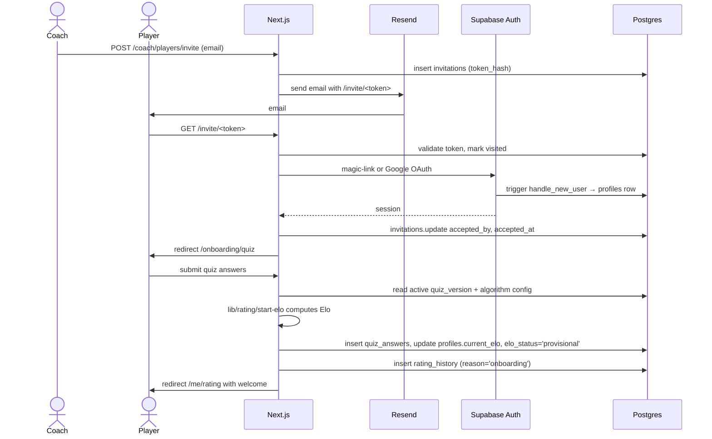
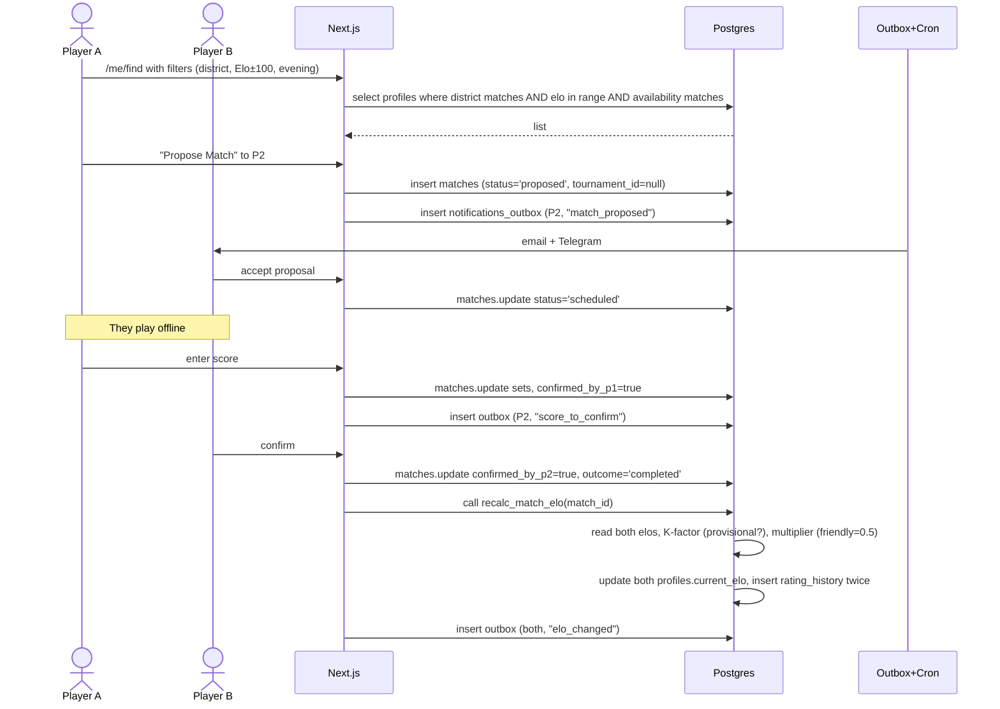
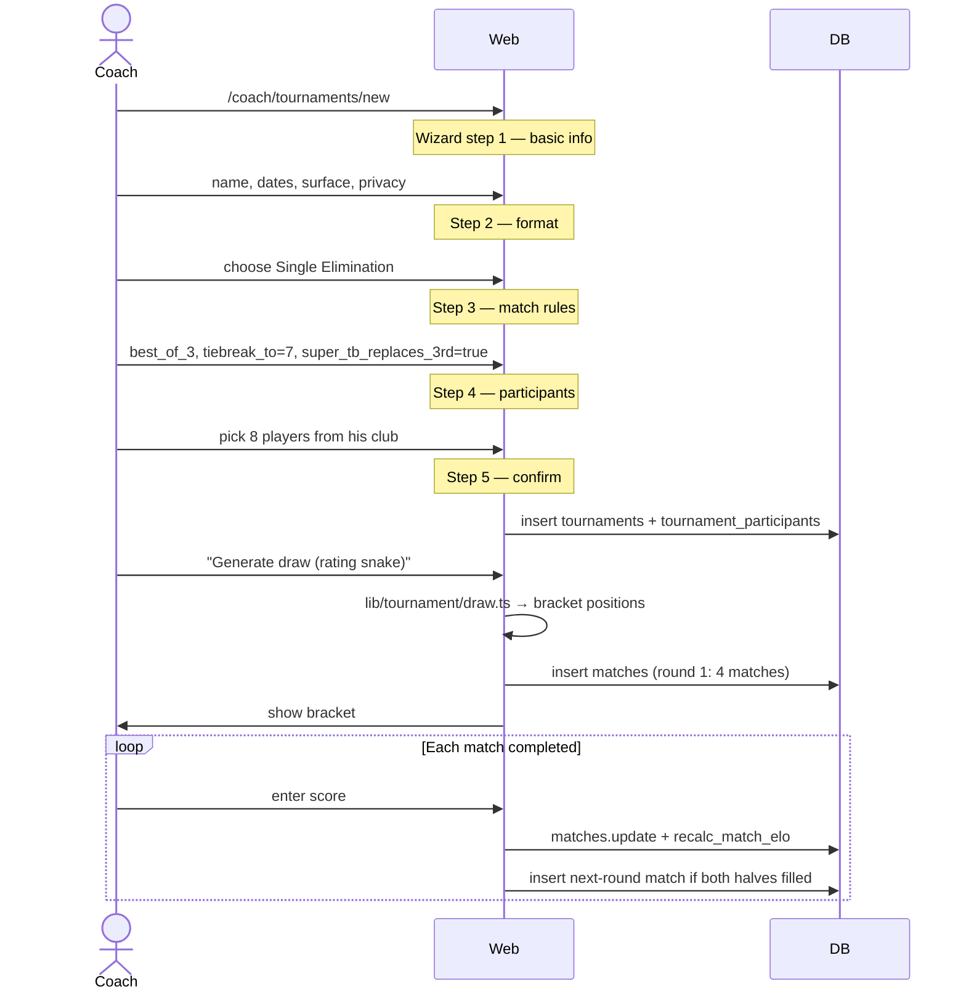
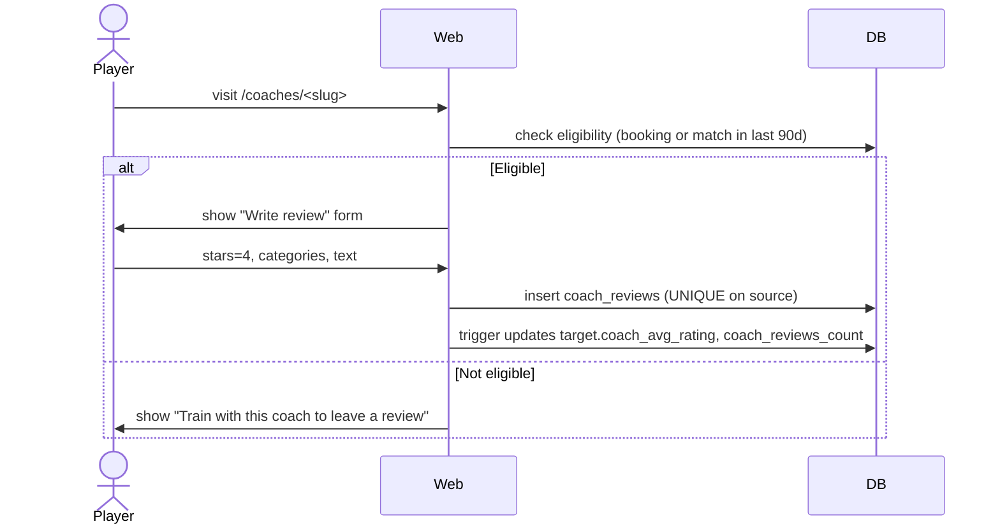
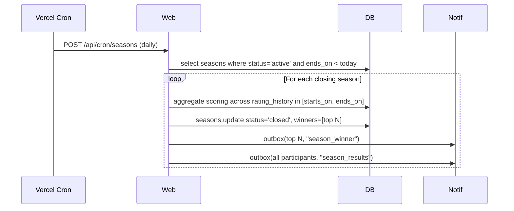

# User flows — sequence diagrams

## 1. Player onboarding (invitation → quiz → start Elo)

## 2. Find a Player → friendly match → Elo update

## 3. Coach creates tournament with bracket

## 4. Coach review (anti-fraud)

## 5. Season race close

